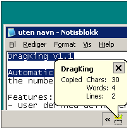

## DragKing v1.3

 [DragKing Download](http://www.donationcoder.com/Software/Skrommel/RecentRun/RecentRun.exe)
 [DragKing Source](http://www.donationcoder.com/Software/Skrommel/DragKing/DragKing.ahk) 205KB

Automatically copies mouse selections to the clipboard. Reports the number of copied characters, words and lines. 

Features:
- User defined delimiter settings. 
- Doubleclick the tray icon to disable/enable

Changes:
- 2005.09.04 - v1.1: Also reports the number of words and lines. Added ini file for user defined delimiters.
- 2005.09.05 - v1.2: Added more status options.
- 2006.05.09 - v1.3: Added hotkeys for pasting and disabling.

Thanks to vevola at [DonationCoder Forum] (http://www.donationcoder.com/forum/index.php?topic=191.0) for the idea!
